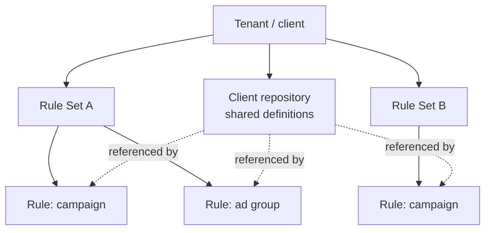
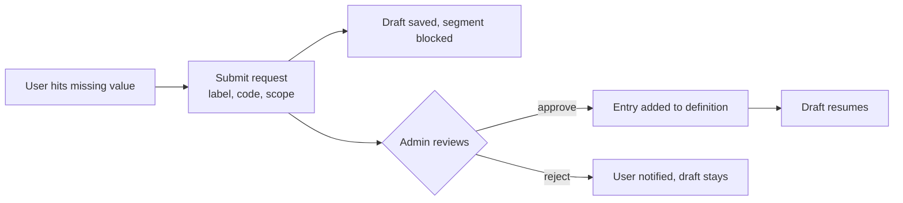

# Campaign Naming Taxonomy Tool v3

## Shared client definitions and role-based authoring

Sep 24, 2026 · @Fela

## Purpose and what changed from v2

v3 turns the single-client Campaign Naming Taxonomy Tool into a multi-tenant product where each client owns a central repository of shared definitions, authored by a privileged admin and consumed by everyone else. v2 treated every Rule Set as an island with its own inline enum values; v3 puts a client layer above Rule Sets so region, brand, market and any other client-specific dimension is defined once and visible everywhere.

What carries forward unchanged: one shared TypeScript engine (compose and validate) behind Author, Build and Check, with the round-trip guarantee that any name the builder produces passes the checker; the Firebase and GCP stack; the Rule Set and Rule model with per-Rule delimiter, ordered segments and BigQuery source binding; batch build and UTM generation.

What is new in v3:

1. Hard multi-tenancy: clients cannot see each other, at every layer.
2. Two-dimensional access: tenant membership plus a two-role split, admin and standard user. v2 described these informally as convention owner and campaign builder or analyst; v3 enforces them through Auth claims and Firestore rules.
3. A client-level central repository of shared definitions, extensible by admins rather than fixed to a set of categories.
4. Platform scoping on shared definitions, so search-only dimensions such as brand vs generic stay out of view on other platforms.
5. Label/code enum entries: a readable label in the UI, an author-defined code in the generated name.
6. A request queue so standard users can propose missing values for admin approval, with drafts held while blocked.
7. Hard edits to shared values: the current definition is the only truth, with an impact preview before an admin saves a change.

The last two steps of v2 planning (paper dry run, release slicing) still apply and are re-based on this scope in the planning section.

## Product view

The tool has three levels: a tenant (client), the Rule Sets within it, and the Rules within each Rule Set. The client level is new and holds the shared repository.



Rules reference shared definitions from the repository instead of each Rule Set defining region, brand or market on its own.

### Roles

| Role | Can do | Cannot do |
| --- | --- | --- |
| Admin | Author the client repository: add definitions, set codes, set platform scope; approve or reject requests; author Rule Sets and Rules; Build and Check | See other tenants |
| Standard user | Build and Check against existing Rules; request a missing value | Change the repository; see other tenants |

A user belongs to exactly one tenant and holds one role within it. No further gradations for v3.

### The client repository

The repository is a set of named shared definitions, for example Region, Brand, Market, Campaign objective. Admins create whatever definitions the client needs; the categories are not fixed by the product. Each definition holds a list of entries, and each entry is a label/code pair: the label is what people see in dropdowns (Awareness), the code is what the engine writes into names (AWA). Codes are always typed by the admin, never suggested by the tool, and must be unique within a definition.

A definition can be scoped to one or more platforms. Brand vs generic applies to Google Ads and Microsoft Ads only, so a Rule for Meta never sees it. Platform is the only scope dimension in v3.

### Author, Build and Check by role

Author now works at two levels. Admins author the repository (client level) and Rules (Rule Set level). When authoring an enum segment in a Rule, the admin either points it at a shared definition, filtered to the Rule's platform, or defines an inline list as in v2.

Build is unchanged for a user who has every value they need: pick values from labels, the engine emits codes, batch build fans out combinations. A user who finds a value missing submits a request naming the definition, the label, the code and the platform scope. The build is saved as a draft and the user is blocked on that segment until an admin approves. On approval the value appears in the list and the draft resumes.

Check validates names in BigQuery or CSV against codes, since codes are what land in the platform. The current definition is the only truth: if an admin changes a code, every name still carrying the old code becomes non-compliant, whatever its history. Before saving such a change the admin sees an impact preview counting the live names that would fail.



## Technical detail

Tenant isolation is enforced at the data layer, not the UI. Every document in Firestore lives under a tenant, every Auth user carries a tenant claim, and every BigQuery scan resolves its source through the tenant's own bindings.

### Tenant isolation

| Layer | Mechanism |
| --- | --- |
| Firestore | All data nested under `tenants/{tenantId}/...`; security rules deny any read or write where the caller's `tenantId` claim does not match the path |
| Firebase Auth | Custom claims `tenantId` and `role` (`admin` or `user`) set server-side; a user has one tenant |
| Callable functions | Read `tenantId` from the verified token, never from the request body; every query is scoped by it |
| BigQuery | Per-Rule source binding as in v2, but the allowed datasets for a tenant are whitelisted in tenant config; a scan against a dataset outside that list is refused |

Hard boundary from day one. If the same organisation later runs several brands as tenants, cross-tenant reporting is an additive feature on top, not a relaxation of the rules.

### Data model

```
tenants/{tenantId}
  config                    allowedDatasets[], platforms[]
  users/{uid}               role: "admin" | "user"
  definitions/{definitionId}
    name                    "Campaign objective"
    platforms[]             [] = all platforms; ["google","microsoft"] = scoped
    entries[]               { label: "Awareness", code: "AWA" }
    updatedAt, updatedBy
  rulesets/{ruleSetId}      one document, Rules inline as in v2 (D5)
    rules[]                 tags.platform required on any Rule that references a scoped definition
  requests/{requestId}
    definitionId, label, code, platforms[], requestedBy, status, draftId
  drafts/{draftId}
    ruleId, selections, blockedSegmentId, status
```

An enum segment on a Rule has one of two forms: `{ kind: "enum", definitionId }` for a shared definition, or `{ kind: "enum", allowedValues: [{ label, code }] }` for an inline list. Inline entries are label/code pairs too, so the engine sees one shape; v2's flat `allowedValues: string[]` migrates as label = code. When a segment references a definition, the Rule's existing `tags.platform` must be in the definition's `platforms` list or the list must be empty; the Author UI only offers definitions that pass this filter. Uniqueness of labels and codes within a definition or an inline list is checked by a `checkDefinition` function in `@taxo/shared`, called before every save, since Security Rules cannot loop over list elements.

### Shared engine

`compose` takes selections by code and emits the name. `validate` splits on the delimiter and matches each enum segment against the codes of its resolved entries. Both functions receive the resolved entries as input, so the engine has no Firestore dependency and the round-trip property holds: the codes the builder writes are exactly the codes the checker accepts. Resolution of `definitionId` to entries happens in the app layer before calling the engine.

Uniqueness is enforced on write: a definition cannot hold two entries with the same code or the same label, and an inline list is held to the same rule.

### Requests and drafts

A request records what the user proposed and points at the draft it blocks. The admin's approval screen shows the proposal alongside the current entries of that definition and flags any label or code collision before the approve button is enabled. Approval writes the entry to the definition and marks the request `approved`; the draft's blocked segment clears and the user is notified. Rejection marks the request `rejected` with a reason and leaves the draft in place.

### Editing shared values

Changing or removing an entry's code is a hard change. Before the write commits, a callable function runs the tenant's Rules that reference the definition against their bound BigQuery sources and returns the count of distinct live names that would fail under the new entries. The admin sees that count and confirms. No versions and no retired codes are stored.

### Stack

Unchanged from v2: Firebase Hosting, React, Vite, plain TypeScript, Firestore, Firebase Auth with Google sign-in, callable Cloud Functions bundled with esbuild, BigQuery in the same GCP project, pnpm workspaces with the engine in `@taxo/shared`. Security Rules keep v2's coarse shape checks and `updatedBy` (D31) and add the `tenantId` and `role` claim checks.

## Decisions log

v3 decisions continue the v2 numbering. v2 decisions not listed here stand unless superseded below.

| # | Date | Decision |
| --- | --- | --- |
| D35 | 24 Sep 2026 | The product is multi-tenant with a hard boundary between clients from day one; internal multi-brand use is a later relaxation, not the design basis |
| D36 | 24 Sep 2026 | Access is two-dimensional: tenant membership and one of two roles, admin or standard user; no further gradations in v3 |
| D37 | 24 Sep 2026 | A client-level repository holds shared definitions visible across all Rule Sets; admins define the categories, the product does not fix them |
| D38 | 24 Sep 2026 | Shared definitions can be scoped by platform; platform is the only scope dimension in v3, modelled so others can be added later without a rebuild |
| D39 | 24 Sep 2026 | Enum entries are label/code pairs; the code is always author-defined, never auto-suggested; codes and labels are unique within a definition |
| D40 | 24 Sep 2026 | Codes are what the engine writes and the checker validates; labels are display only |
| D41 | 24 Sep 2026 | Standard users request missing values (label, code, scope) and admins approve or reject; the admin approves rather than authors |
| D42 | 24 Sep 2026 | A user with a pending request is blocked on that segment; no freeform fallback. The build is saved as a draft and resumes on approval |
| D43 | 24 Sep 2026 | Editing a shared value is hard: the current definition is the only truth and any non-matching name is non-compliant regardless of history. No versioning, no retired codes |
| D44 | 24 Sep 2026 | Admins see an impact preview (count of live names that would fail) before a code change saves |
| D45 | 24 Sep 2026 | The spec is renamed v3 with a subtitle to mark a new product shape rather than a revision of v2 |

Superseded from v2: D4 and D5's flat string enum values (D39 makes every entry a label/code pair); D12's owner-only writes (D35 and D36 replace ownership with tenant plus role); D14's deferral of roles and approvals (both now in scope) and of versioning (now rejected outright by D43). Inline enum lists on Rules remain available alongside shared definitions (O14).

## Pending questions

Numbering continues from v2's O1 to O10. v2 items still open (O2 environments, O3 CI host, O4 support owner, O5 budget, O10 client reply deadline) carry forward unchanged and are not repeated here. None of the items below blocks the spec review.

| # | Question | Blocks | Recommendation |
| --- | --- | --- | --- |
| O11 | Who creates a tenant and its first admin: a superadmin outside any tenant, or a manual step by Fela? | Phase 1 | Manual provisioning by Fela in v3; superadmin only if a third tenant arrives |
| O12 | Is the platform list fixed by the product or configured per tenant? | Definition scoping | Fixed product list, tenants pick a subset in config |
| O13 | Does a Rule carry exactly one platform, or can one Rule serve several? | Author filter on definitions | One platform per Rule, using the existing optional tags.platform and making it required where a scoped definition is referenced |
| O14 | Keep inline enum lists on Rules, or require every enum to come from the repository? | Author UI, engine input shape | Keep inline for v3 as a compatibility path; revisit once the repository is in use |
| O15 | Migrate v2 Rule Sets into a first tenant with label = code, or start v3 empty? | Phase 1, G4 | Migrate into one tenant; the paper dry run (G2) validates the result |
| O16 | Impact preview runs a scan per referencing Rule: synchronous confirm, or background estimate? | Phase 3 | Synchronous with a timeout; fall back to a count from the last completed scan |
| O17 | Request notifications: email, in-app, or both? | Phase 4 | In-app first; email once a mail provider is chosen |
| O18 | Cross-level validation stayed out of scope in v2. Does that still hold with shared definitions in play? | Scope | Yes; inherited segments already share values by reference |
| O19 | Optional structured tags on Rules for dimensional rollups (open since v1) | Check rollups | Platform on the Rule (O13) covers the first dimension; defer the rest |

## Planning phase and gates

No code until the gates pass, in order. The gates keep v2's names and shape; their exit criteria are re-based on v3 scope. G0 in v2 (accept D24 to D34) is treated as done by this spec's carry-forward.

| Gate | Exit criteria | Evidence | Owner |
| --- | --- | --- | --- |
| G0 Spec review | D35 to D45 accepted or overruled; O11 to O19 each carry an answer or an accepted default | Decisions log with no Proposed entries | Fela |
| G1 Model-changing questions | O11, O12, O13 and O15 answered; v2's P1, P5, P7 and P12 client questions still answered or defaulted per O10 | Answers recorded against each question | Fela with client |
| G2 Paper dry run | The originating client's conventions rebuilt as a tenant: repository definitions with label/code entries, Rules referencing them; a sample of real names (target 200 per Rule) checked against codes; pass rate and failure classes recorded with a decision each | Dry-run sheet and failure-class list | Fela |
| G3 Release slicing and docs | Phases below confirmed; per-feature spec sheets and Claude Code prompts written for phase 1; CLAUDE.md, docs/spec.md and the client briefing updated for multi-tenancy and the repository | Updated documents; per-phase acceptance list | Fela |
| G4 Build readiness | Firestore rules and Auth claims design reviewed; O15 migration approach settled; v2's O2, O3 and O4 decided | Checklist with status; no open item blocking phase 1 | Fela |

### Release phases

v2 sliced work as R1 hierarchy and UTMs, R2 batch build, R3 Stage 2 BigQuery scan. v3 inserts the tenant foundation and repository ahead of them and re-bases the rest.

| Phase | Scope | Depends on | v2 equivalent |
| --- | --- | --- | --- |
| 1. Foundation | Tenant model, Auth claims, Firestore rules, admin and user roles, tenant config with allowed datasets, migration of v2 data into a first tenant (O15) | Nothing | New |
| 2. Repository | Client-level definitions with label/code entries, platform scoping, uniqueness checks, Rule segments referencing definitions, engine and hierarchy working on codes, UTM mappings re-based on codes | Phase 1 | R1, re-based |
| 3. Batch build | Batch and child fan-out over code-based Rules | Phase 2 | R2, unchanged in behaviour |
| 4. Hard edits and Check | Check running against codes in BigQuery and CSV; impact preview on code changes | Phase 2 | R3 plus the preview |
| 5. Requests | Request queue, drafts, blocking, admin approval with collision flag, notifications | Phase 2 | New |

Phases 3, 4 and 5 can run in parallel once phase 2 is done. Phase 5 is last by intent: it refines a system that has to exist before requests make sense.
